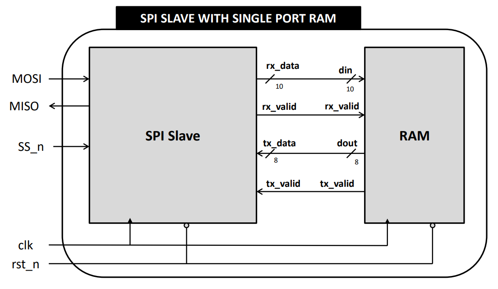

# SPI Slave with Single Port RAM
 
## Project Overview
This project implements an SPI Slave with a Single Port RAM interface. It allows an SPI master device to read from and write to a RAM module via an SPI interface. This is useful in applications where memory needs to be shared between a microcontroller (acting as the SPI master) and other peripherals.

## SPI Slave with Single Port RAM Block Diagram

## Finite State Machine of the SPI Slave

## Project Structure

- **/Source**: Contains the Verilog source files implementing the SPI modules and the testbench file for simulating and verifying the functionality of the SPI modules and memory initialization file also the run_me.do for automation.

- **/Constraints**: Contains the Constraint files for the Basys 3 Artix-7™ FPGA.

- **/Netlist**: Contains the netlist file generated by vivado.

- **/Bitstream**: Contains the bitstream file generated by vivado to configure the FPGA.